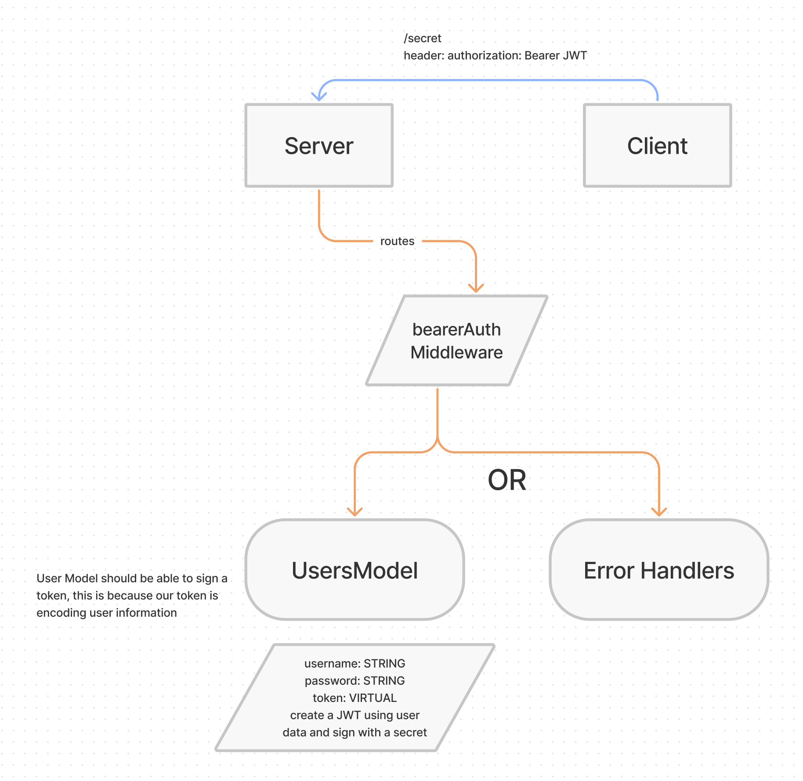

# Bearer Authorization

Created by Ryan Emmans

## Summary of Problem Domain

### **Phase 1 Requirements**

#### **As a user, I want to create a new account so that I may later login**

- Using a tool such as httpie, postman, or a web form:
  - Make a POST request to the/signup route with username and password
  - Your server should support both JSON and FORM data as input
  - On a successful account creation, return a 201 status with the user object in the body
  - On any error, trigger your error handler with an appropriate error

#### **As a user, I want to login to my account so that I may access protected information**

- Using a tool such as httpie, postman, or a web form:
  - Make a POST request to the /signin route
  - Send a basic authentication header with a properly encoded username and password combination
  - On a successful account login, return a 200 status with the user object in the body
  - On any error, trigger your error handler with the message “Invalid Login”

### **Phase 2 Requirements**

Any user that has successfully logged in using basic authentication (username and password) is able to continuously authenticate … using a “token”

#### **As a user, I want to obtain a token after I signin, so that I can re-authenticate**

- Using a tool such as httpie, postman, or a web form:
  - Following a POST to `/signup` to create an account (or) Following a POST to `/signin with basic authorization
    - Send a response to the client with the proper status code along with an object with the following properties

      ```js
      {
        user: {
          _id: 'ID FROM DB',
          username: 'myusername'
        },
        token: 'JWT Token Here'
      }
      ```

### **As a user, I want to use my token to access routes that require a valid user**

- Using httpie or postman, send a request to a “protected” route, such as `/secretstuff`
  - Your request must send an “Authorization” header, with the value of Bearer TOKEN
    - **TOKEN** is the token that you would have returned to the user after their signin step (above)
  - If the **TOKEN** is valid (i.e. if it represents an actual user)
The route should function as it normally would (sending a response)
  - If not
    - Send the user an error message stating “Invalid Login”

### **As the website owner, I want our token system to be as secure as possible so that our users can feel safe when logging in**

- Research ways to “secure” our JWT Tokens
- Implement one or more methods to secure our login tokens

## Links to application deployment

- [Heroku Main Branch](https://ryanemmans-bearer-auth.herokuapp.com/)
- [GitHub Actions](https://github.com/ryanemmans/bearer-auth/actions)
- [Pull Requests](https://github.com/ryanemmans/bearer-auth/pulls?q=is%3Apr+is%3Aclosed)

## UML



## Routes

- POST route for `/signup`
  - Accepts either a JSON object or FORM Data with the keys “username” and “password”.
  - Creates a new user record in a Postgres database.
  - Returns a 201 with the created user record.
- POST route for `/signin`
  - Use your basic authentication middleware to perform the actual login task.
  - `router.post('/signin', basicAuth, (req,res) => {});`
  - When validated, send a JSON object as the response with the following properties:
    - `user`: The users’ database record
- GET route for `/secret`
